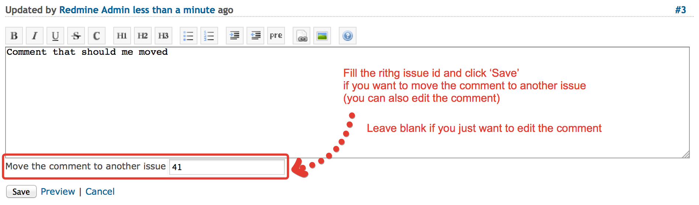

# Redmine Move Comments

The plugin allows you to move a comment made to wrong issue to the right one.

## Features

* Ability to move an issue's comment to another issue

## Screenshot




## Getting the plugin

A copy of the plugin can be downloaded from GitHub: http://github.com/VoronyukM/redmine_move_comments

## Installation

```
cd /path/to/redmine/
git clone https://github.com/VoronyukM/redmine_move_comments.git
```

Restart the Redmine.

Migrate is not needed.


To uninstall the plugin migrate the database back and remove the plugin:

```
cd /path/to/redmine/
rm -rf plugins/redmine_move_comments
```

Further information about plugin installation can be found at: http://www.redmine.org/wiki/redmine/Plugins

## Usage

You should be allowed to edit the comments for moving them, i.e. have 'Edit notes' or 'Edit own notes' permissions in Issue tracking section. See details: http://www.redmine.org/projects/redmine/wiki/RedmineRoles

## Compatibility

The latest version of this plugin is only compatible with Redmine 2.4.x., 2.5.x and 2.6.x

## Contribution

## License

This plugin is licensed under the MIT license. See LICENSE-file for details.

## Copyright

Copyright (c) 2015 Mikhail Voronyuk, www.3soft.ru. 
